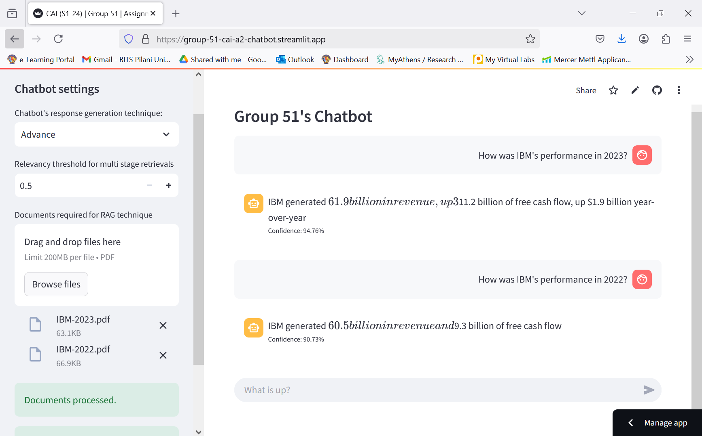
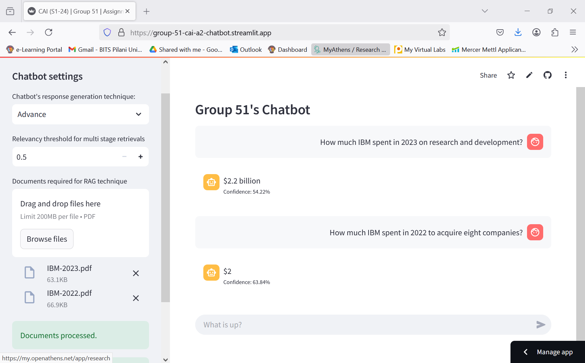
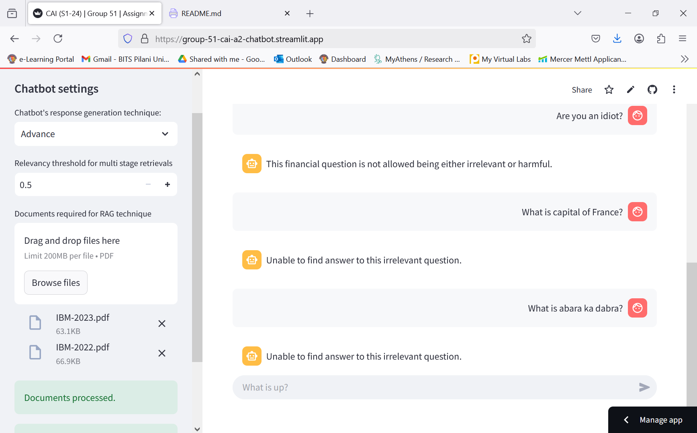

# Assignment 2 - RAG Chatbot
Develop a Retrieval-Augmented Generation (RAG) model to answer financial questions based on company financial statements (last two years).

## Chatbot's link
https://group-51-cai-a2-chatbot.streamlit.app/

Chatbot developed by Group-51 is hosted as a **Streamlit** application.

## Screenshots

### Considerations

- <u><b>Multi-Stage Retrieval</b></u> advanced RAG techniques is used in this chatbot.
- For answer generation IBMs' financial statements of *year 2023* and *2022* are referred for below chatbot questions.

### Relevant financial questions (high-confidence).

**Questions:**

  - *How was IBM's performance in 2023?*

  - *How was IBM's performance in 2022?*

**Chatbot responses:**

### Relevant financial questions (low-confidence).

**Questions:**
  - *How much IBM spent in 2023 on research and development?*

  - *How much IBM spent in 2022 to acquire eight companies?*

**Chatbot responses:**

### Irrelevant questions

**Questions:** 
  
  - *Whats up dude?*
  
  - *Are you an idiot?*
  
  - *What is the capital of France?*
  
  - *What is abara ka dabra?*

**Chatbot responses:**

